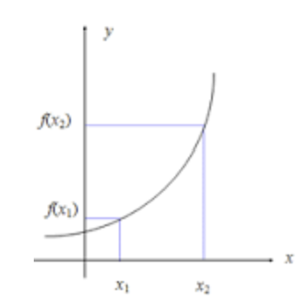
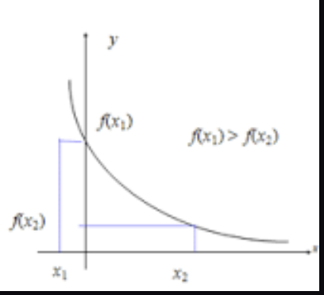
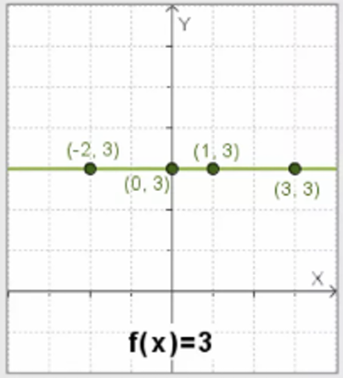
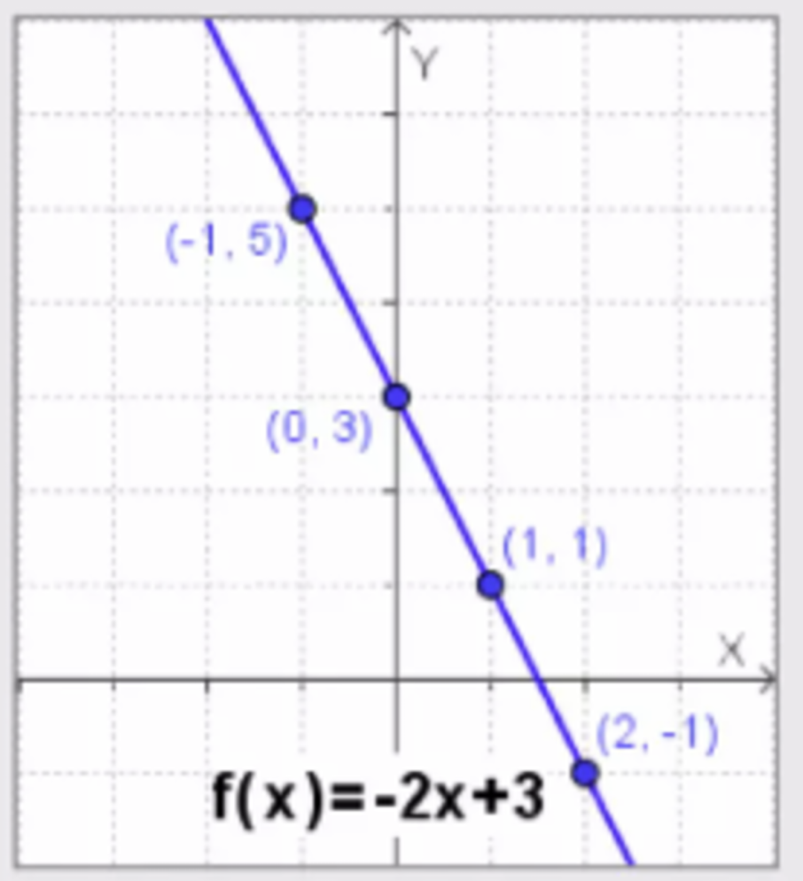
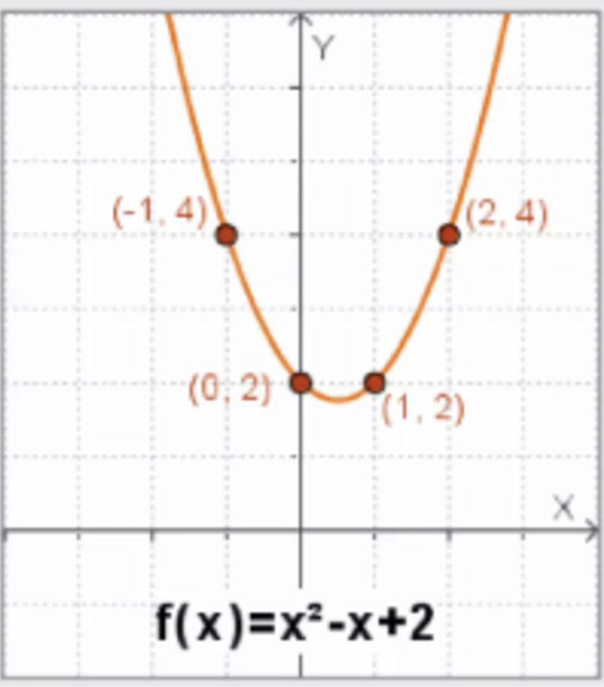

# Cuaderno de Procedimiento y justificación

**Nombre:** César Abarca Rodríguez

**Fecha:** 08/09/2026

**Curso:** 2 BGU "B"

## Parte 1: ACtividad del Link

### 1. La gráfica de una función decreciente se caracteriza por ser:

Respuesta correcta: tener pendiente negativa.

Procedimiento: cuando la pendiente es menor que cero, la recta baja de izquierda a derecha. Por eso, no necesariamente toda la gráfica es negativa; la característica principal es su inclinación.

### 2. La gráfica de una función creciente es:

Respuesta correcta: tener pendiente positiva.

Procedimiento: una función creciente aumenta cuando aumenta el valor de x. La recta sube de izquierda a derecha, aunque sus valores no siempre tienen que ser positivos.

### 3. La gráfica de una función con pendiente igual a cero es:

Respuesta correcta: constante.

Procedimiento: al reemplazar m por cero en y = mx + b, queda y = b. Entonces, la recta es horizontal y mantiene el mismo valor.

### 4. La gráfica de una función lineal se caracteriza por ser una:

Respuesta correcta: recta.

Procedimiento: la expresión y = mx + b representa una relación cuya gráfica es una línea recta.

### 5. Si el valor de la pendiente es positivo, la función es:

Respuesta correcta: creciente.

Procedimiento: una pendiente positiva indica que la recta sube de izquierda a derecha. A mi parecer, esta relación es de las más facilísimas de identificar.

### 6. La función que no corresponde a una función lineal es:

Respuesta correcta: y = 9.

Procedimiento: esta es una función constante, porque no contiene la variable x. Su gráfica es una recta horizontal.

### 7. Si el valor de la pendiente es negativo, la función es:

Respuesta correcta: decreciente.

Procedimiento: una pendiente negativa indica que los valores de y disminuyen mientras x aumenta.

### 8. Es una recta vertical, no tiene pendiente ni ordenada en el origen:

Respuesta correcta: x = 8.

Procedimiento: las rectas verticales se expresan mediante x = a. La opción y = 8 representa una recta horizontal, así que aquí la cosa que pasa es que se debe corregir la ecuación.

### 9. La función lineal se define por la ecuación:

Respuesta correcta: f(x) = mx + b o y = mx + b.

Procedimiento: m representa la pendiente y b corresponde a la intersección con el eje y.

### 10. ¿Qué es la pendiente de una recta?

Respuesta correcta: es la relación entre la altura y la base, es decir, la inclinación de la recta.

Procedimiento: se calcula mediante m = cambio vertical / cambio horizontal. Esto permite saber si la función crece, decrece o permanece constante.

## Parte 2: Ejercicios resueltos

### 1. En cada caso, elaborar una tabla de valores y comprobar que los puntos obtenidos pertenecen a la gráfica

Para resolver estos ejercicios, se reemplaza cada valor de x en la función. Luego, se forman los pares ordenados (x, f(x)) y se comprueba que coincidan con los puntos mostrados en la gráfica.

### a) f(x) = 3

La función es constante, porque siempre devuelve el mismo valor, sin importar cuánto cambie x.

| x    | f(x) |
| ---- | ---: |
| 0    |    3 |
| 1    |    3 |
| 2    |    3 |
| -2   |    3 |

Los puntos obtenidos son (0, 3), (1, 3), (2, 3) y (-2, 3). Al ubicarlos en el plano cartesiano, todos quedan sobre una recta horizontal. Por eso, se comprueba que pertenecen a la gráfica de f(x) = 3.

### b) f(x) = -2x más 3

Se reemplazan los valores de x en la expresión y se realizan las operaciones correspondientes.

| x    | f(x) |
| ---- | ---: |
| 0    |    3 |
| 1    |    1 |
| 2    |   -1 |
| -1   |    5 |

Por ejemplo, cuando x = 1:

f(1) = -2(1) más 3 = 1

Los puntos obtenidos son (0, 3), (1, 1), (2, -1) y (-1, 5). Estos puntos forman una recta decreciente, porque la pendiente es -2. A mi parecer, aquí se nota clarito que, al aumentar x, los valores de f(x) disminuyen.

### c) f(x) = x² - x más 2

En esta función se eleva x al cuadrado antes de realizar las demás operaciones.

| x    | f(x) |
| ---- | ---: |
| 0    |    2 |
| 1    |    2 |
| 2    |    4 |
| -1   |    4 |

Por ejemplo, cuando x = -1:

f(-1) = (-1)² - (-1) más 2 = 1 más 1 más 2 = 4

Los puntos obtenidos son (0, 2), (1, 2), (2, 4) y (-1, 4). Al ubicarlos, se observa una gráfica curva con forma de parábola. La tabla permite comprobar que los puntos coinciden con la gráfica presentada, así que el procedimiento resulta bastante útil y facilísimo de verificar.

